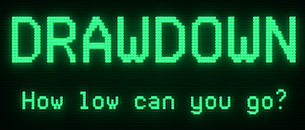

*A retro market simulator.*  

---

**Drawdown** is a deliberately lean simulation of stock market decision-making, a modern tribute to [*Millionaire: The Stock Market Simulation*, created by Jim Zuber and published by Blue Chip Software in 1982](https://en.wikipedia.org/wiki/Millionaire:_The_Stock_Market_Simulation).  Hopefully it will make you feel smart, rich, and wrong —  all at once.

## Gameplay Overview

| **Phase**              | **What Happens**                                                                 |
|------------------------|-----------------------------------------------------------------------------------|
| **Start Game**         | Player chooses new game or resume; gets $35,000 and “Novice” status              |
| **Weekly Loop (×104)** |                                                                                   |
| • Market Opens         | Show updated overall index graph + selected industry trend                       |
| • News Packet          | ~10 headlines (macro, sector, company-specific); foreshadows price shifts        |
| • Price Report         | Show current prices, highs/lows, changes for a subset (or all) of 500 stocks     |
| • Player Actions       | Access graphs, research, buy/sell stocks or options, borrow, check portfolio     |
| • Advance Week         | Player commits — market updates, interest charged, options decay, prices shift   |
| **Level Up**           | As net worth increases, unlock: margin, call options, puts, loans                |
| **Game End**           | After 104 weeks or $3.3M net worth; show final score, time-to-victory        |

---

## Status

- It’s not finished. It doesn't even work at all yet.
- This README is the user manual. That should be enough for you.

---

## Disclaimer

This is a personal software project. It is **not** financial advice, an investment strategy simulator, a trading aid, or any form of economic guidance. It is a work of creative fiction and software nostalgia. Use it for entertainment only.

---

## License

MIT License. Do what you want, but don’t blame me when your portfolio goes to zero.

---

© 2025 Steve Drasco · steve.drasco@gmail.com
